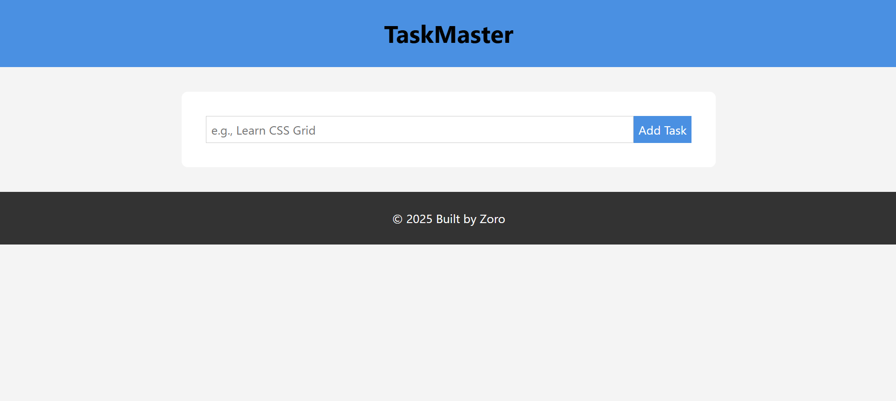
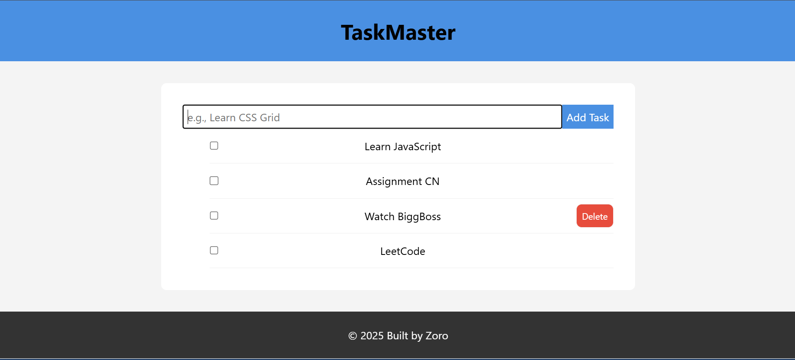

# TaskMaster - A Simple Todo App

A clean and intuitive task management application built with Vanilla JavaScript to help users stay organized. This project demonstrates full C.R.U.D. functionality and saves all data to the browser's Local Storage, ensuring tasks persist between sessions.

## Screenshot

## Built With
* HTML5
* CSS3 (with Flexbox for responsive layout)
* Vanilla JavaScript (for DOM Manipulation & Local Storage)

## What I Learned
* **Full C.R.U.D. Implementation:** Successfully built a complete Create, Read, Update, and Delete feature set from scratch.
* **Data Persistence:** Mastered the use of the browser's Local Storage to save and retrieve user data, making the application stateful.
* **Data-Driven UI:** Refactored the code from direct DOM manipulation to a professional, data-driven structure using a JavaScript array as the "single source of truth" and a `render()` function.
* **Modern JavaScript:** Gained practical experience with `const`/`let`, event listeners, callback functions, and array methods like `.forEach()` and `.splice()`.
* **Professional CSS:** Implemented best practices for responsive design (`max-width`) and accessibility (`rem` units).
